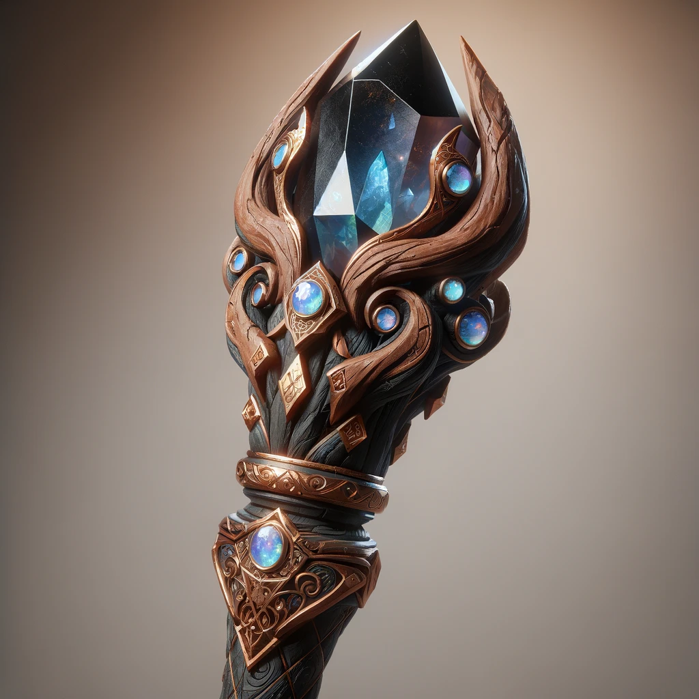

# Basic

## Name

Given: Arcanum Echo

True: (???)

## Type / Form

Enchantment Crystal (Grade B) (High Capacity, fragmented pockets)

Abyssal Cloud (???) (???) (???)

## Status

1/6 Wounds

# Skills & Abilities

# Perception

Sense of self - 2

*The creature has the ability to examine the status of it's own body and energy levels.*

# Magic

Arcana - 2 *(-1)*

*The creature has gained a rudimentry understanding of practical arcana, but lack theoretical or academic knowledge for a deeper understanding of general arcane practice.*

Enchantment - 1 *(-1)*

*The creature has gained a rudimentry understanding of practical enchantment, but lack theoretical or academic knowledge for a deeper understanding of general enchantment practice.*

Energy Harvesting - 1

(Situational dice: +1 for harvesting via psionic links)

*The creature has learned the basics of harvesting ambient energy sources.*

Entropy Control - 2

(Situational dice: +1 for portal research)

*The creature is adapted to the chaotic energies of the Abyssal Shore, reducing negative effects or utilizing them for benefit.*

# Psionics

Psionics  - 3

*The creature has learned how to use it's mind and mental energy to penetrate the minds of other living beings.*

Minion Control - 2

*The creature has learned how to dominate the minds of others using it's psionic ability. This is most effective on shards of itself broken off it's body.*

# Knowledge

Recollection of the Past - 3

*Occasionally receive guidance or hints from the echoes of past entities or energies in your lineage.*

## Legacies

*Legacies can grant circumstantional bonuses to rolls involving previous forms or abilities that the creature has lost. Traits are recorded, but levels are not.*

## Type / Form

Abyssal Echo

Fins

Paddle tail

Bone armor

Bone spikes

Webbed feet

Tentacles

Forward facing eyes

### Perception

Vision (Low Light) (Basic Thermal)

Touch (Advanced Thermal) (Advanced Pressure)

Hearing

Echolocation

### Mobility

Swimming
