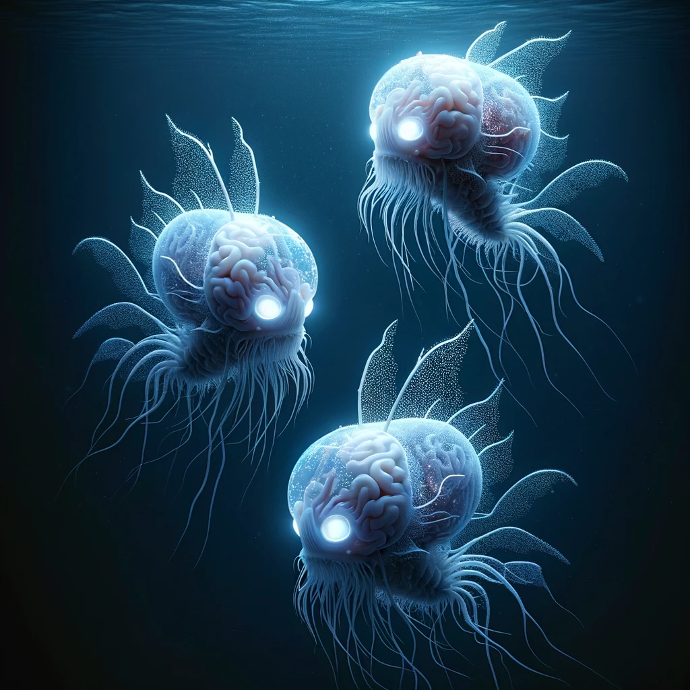

# General

Elven Wizard Jonathon (Wielder) (Owner) (Weak psionic link, short proximity, emotional)

*The wizard Jonathon is a self taught mage of middling quality. Self taught using used or damages books on magical theory and practical experience. His party (swordsman, archer) saved up enough money to purchase you from a store after your enchantment into the crystal atop a staff. You adventured alongside Jonathon learning from him and teaching him over time. You seperated when he was arrested by town guards for a fight that involved the death of a noble scion.*

Human Artemis Minicle (Strong psionic link, short proximity, senses, control)

*Artemis Minicle is a low level town guardsman. He escorted you to the armory during the arrest of Jonathon. Artemis is involved in some minor smuggling due to a complicated family relationship.*

Mind Spirit Knox (Ally, direct psionic communication)

*Knox is a mind spirit that was trapped in a circlet in the armory. It has been abandoned and forgotten for decades. Knox was feeding on nearby seperates psionically to extend its life. He has made a pact with you and become a willing ally in exchange for eventual independence and a stable environment to live in.*

# Minion(s)

Abyssal/Mental Spirit Minion 1

*A fusion of fragmented energy ripped from Knox and encalpsulated in direct energy from your own strength.*

Abyssal/Mental Spirit Minion 2

*A fusion of fragmented energy ripped from Knox and encalpsulated in direct energy from your own strength.*

Abyssal/Mental Spirit Minion 3

*A fusion of fragmented energy ripped from Knox and encalpsulated in direct energy from your own strength.*